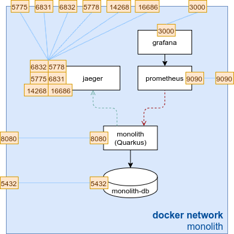

## Introduction

In this lab we will have a look at our shop application. The implementation consists of a monolith with its own
postgresql database.

The application is a small shop including a stock inventory. It provides an RESTful API which is used to create orders.
The article stock count has to be decreasing whenever an article is ordered. If an order includes an
article which is not in stock the order will not be completed.

We will use monitoring and tracing for our application.

## Lab Overview

Our environment looks like this:

