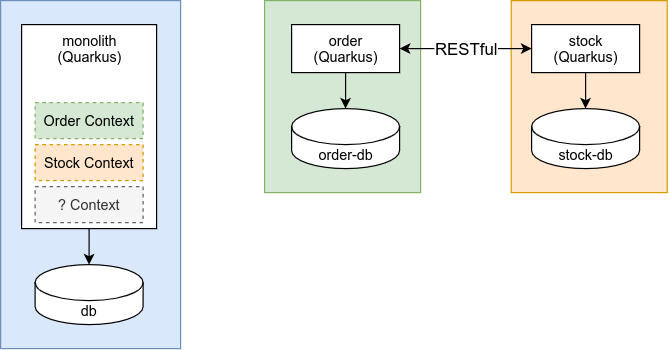
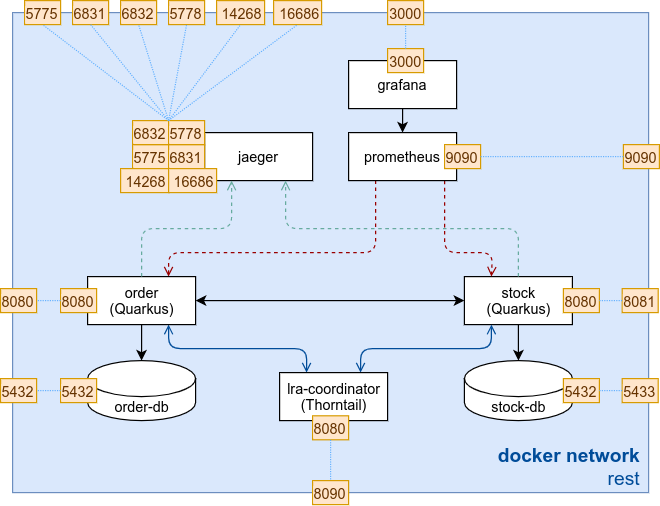

## Introduction
In the previous lab we worked on a monolithic application. In this lab we will distribute the monolith in two independent applications. 
Will split up this monolith in an `order` and `stock` microservice.

Both microservices will use RESTful APIs to communicate with each other. We will see what splitting an application 
can mean in terms of fault tolerance, coupling and data consistency.

In a last step we will have a look at the Microprofile Long Running Actions (LRA)[^1] to coordinate transactions in a SAGA orchestration approach.

### Microprofile LRA

{} The proposal introduces annotations and APIs for services to coordinate long running activities whilst still maintaining loose coupling and doing so in such a way as to guarantee a globally consistent outcome without the need to take locks on data. [...] 

Traditional techniques for guaranteeing consistency in distributed environments has focused on XA transactions where locks may be held for long periods thereby introducing strong coupling between services and decreasing concurrency to unacceptable levels. Additionally, if such a transaction aborts then valuable work which may be valid will be rolled back. In view of these issues an alternative approach is desirable. - [github.com/eclipse/microprofile-lra](https://github.com/eclipse/microprofile-lra/blob/master/spec/src/main/asciidoc/microprofile-lra-spec.adoc) {}

LRA Protocol Sequence - source: [github.com/eclipse/microprofile-lra](https://github.com/eclipse/microprofile-lra/blob/master/spec/src/main/asciidoc/images/lra.png)

## Splitting the Monolith
We will split our monolith in the two contexts `order` and `stock`. The `order` microservice will manage the orders. The `stock` microservice will manage the article stock and will decrement the available stock if there is a new order.

We expect the stock count of an article to be consistent with its order count.

Can you imagine another context which exists in the monolith?

{}
Think of a rich article catalog with pictures, thumbnails and a detailed description. There is a high chance that this would be managed in another independent microservice. For simplicity our articles are fully managed by the `stock` microservice.
{}

## Lab Overview

The first version we will only use the two microservice `order` and `stock`. In a second version we will introduce the `lra-coordinator` and our environment will look like this.

[^1]: Eclipse MicroProfile LRA: https://github.com/eclipse/microprofile-lra/blob/master/spec/src/main/asciidoc/microprofile-lra-spec.adoc