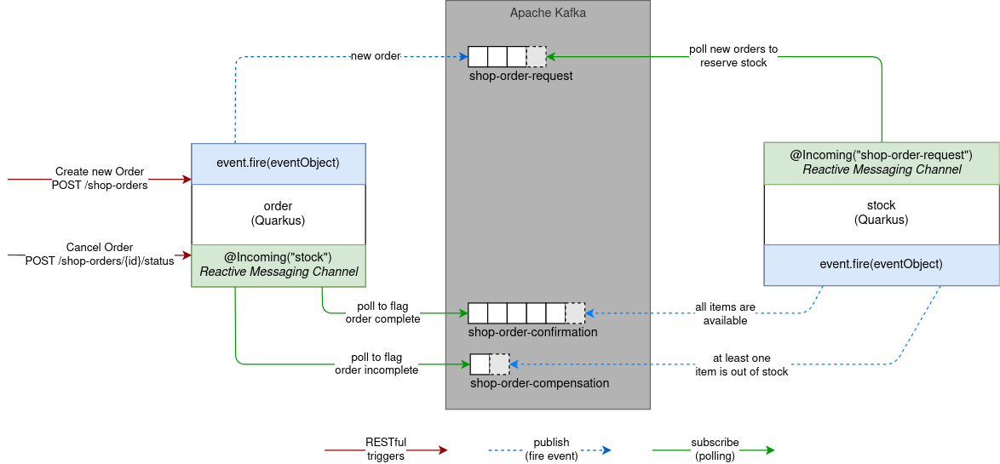
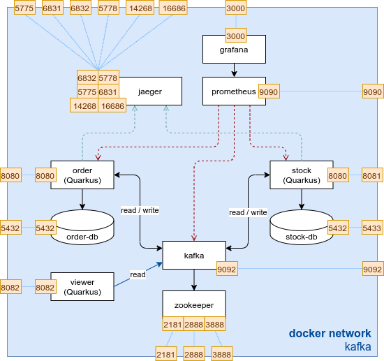

## Introduction

In the previous lab we have split up the monolithic application into a microservice architecture powered by RESTful APIs. The communication via REST gives us a higher coupling due to the fact the microservices won't work when the counterpart is not available. To reduce the coupling even more we are going to use an event driven approach.

In a first step we are going to set up our Apache Kafka cluster which will be our message oriented middleware. We will then reimplement our communication in a reactive messaging approach, to get our system up and running again!

To ensure consistency we are going to implement a simple SAGA pattern with choreography. Each order will trigger an event to a `shop-order-request` topic. The stock microservice will subscribe to this topic and will try to handle the order. If the order was handled successfully by the stock microservice the confirmation will be published or compensated in the case of an error.

Instead of an choreography approach, which other method could be used to ensure the SAGA pattern?

{}
We could have used an orchestrated approach. To ensure orchestration we would have implemented an orchestrator-microservice, which handles the coordination between the two microservices.
{}

## Lab Overview

