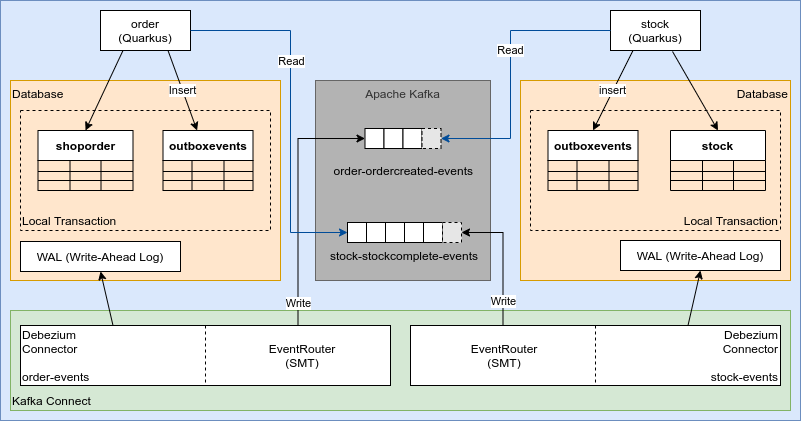
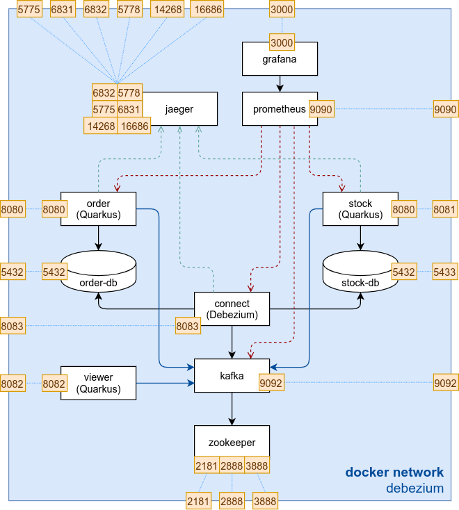

## Introduction

In this lab we will use a different integration pattern. The previous lab using Kafka messaging has a certain design flaw. The microservices are writing to the database using a local transaction. however, this transaction does not span the writing to the Kafka topic. if a rollback occurs, only the data written to the database is rolled back. Handling such cases would need to be handled explicitly in the application code.

In this lab we will use the Outbox Pattern[^1] to get rid of this flaw.

{} The outbox pattern is a way to safely and reliably exchange data between multiple (micro) services. An outbox pattern implementation avoids inconsistencies between a service’s internal state (as typically persisted in its database) and state in events consumed by services that need the same data. - [debezium.io](https://debezium.io/documentation/reference/configuration/outbox-event-router.html) {}

For this to achieve we will use Kafka Connect with a Debezium PostgreSQL source connector.

### Kafka Connect and Debezium

{} Kafka Connect is a tool for scalably and reliably streaming data between Apache Kafka and other systems. It makes it simple to quickly define connectors that move large collections of data into and out of Kafka. - [kafka.apache.org](https://kafka.apache.org/documentation/#connect) {}

{} Debezium’s PostgreSQL connector captures row-level changes in the schemas of a PostgreSQL database. [...] The connector produces a change event for every row-level insert, update, and delete operation that was captured and sends change event records for each table in a separate Kafka topic. Client applications read the Kafka topics that correspond to the database tables of interest, and can react to every row-level event they receive from those topics. - [debezium.io](https://debezium.io/documentation/reference/connectors/postgresql.html) {}

Kafka Connect also provides the functionality to use Single Message Transformations (SMT) to modify a message before it is sent to the Kafka Topic. The Debezium connector also includes an Outbox Event Router[^2].

### Transactional Outbox Pattern

Databases usually write their changes to a write-ahead logfile (WAL) before actually writing them to the database. This provides atomicity and durability.

Debezium makes use of this by reading the WAL to detect changes in the database. This technique is called Change-Data-Capture (CDC)[^3] and is a widely used pattern to integrate legacy systems and applications.

The outbox pattern specifies that beside our business data there will also be an event-record which is written to the dedicated `outboxevent` table. As that will take place in the same local transaction, we have strong guarantee that our data is either written or rolled-back completely including the event.

In Kafka Connect our Debezium connector will monitor the WAL log and watch out for INSERT to the `outboxevent` table. Finding a new record in the WAL log Debezium will generate a Kafka Message to a designated topic. Debezium provides an EventRouter which is implemented as Single Message Transformation. This EventRouter will form our actual Kafka Message using the information from the `outboxevent` table (actually the WAL log).

Our application will therefore only consume messages from Kafka topics.

This integration pattern is highly decoupled. Either the Kafka consumers in our application as debezium are able to recover from where they left of. This guarantees that our application is able to process its tasks if the database is available. Any downtime or network incident between Debezium (Kafka Connect) or Kafka itself will only result in delayed processing of the events.

## Lab Overview

At the end of this lab our environment is expected to look like this. In comparison to the last lab we will introduce the Kafka connect service with our debezium PostgreSQL connector. Further we will create additional `outboxevent` tables and our applications will stop to write to Kafka directly. We will still use saga choreography as in the previous lab.

[^1]: Transactional Outbox Pattern: https://microservices.io/patterns/data/transactional-outbox.html
[^2]: Outbox Event Router: https://debezium.io/documentation/reference/configuration/outbox-event-router.htm
[^3]: Change Data Capture: https://en.wikipedia.org/wiki/Change_data_capture
